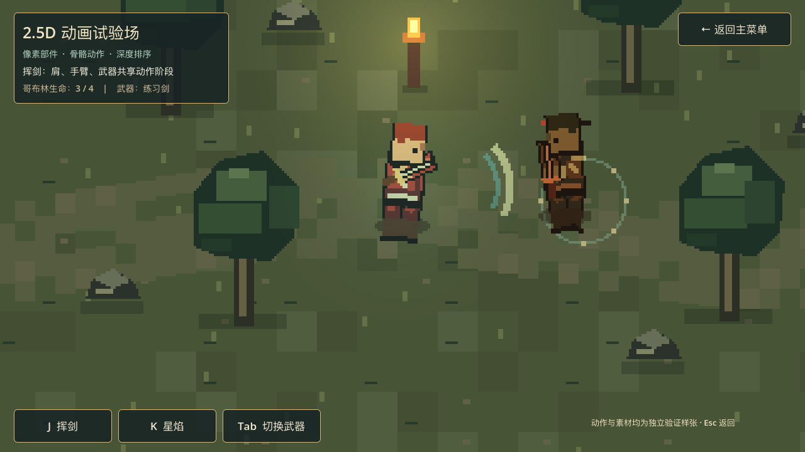
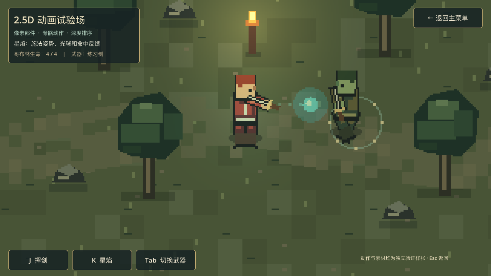

# 2.5D 动画试验场

状态：独立技术样张已实现，视觉方向与主游戏玩法尚待用户评估。入口为主菜单的「2.5D 动画试验场」，场景位于 `Scenes/Prototype/animation_lab.tscn`。现有横版战斗与逐层探索 Demo 沿用原入口和规则。

## 验证目标

用户希望参考[程序化像素与伪 3D 演示](https://www.bilibili.com/video/BV1u3Yt6LEFE/)试做一套可扩展表现，在 Godot 中检验八方向移动、分层角色、挥剑、技能、光照与后续动画的可行性。用户允许未来局内考虑类似《八方旅人》或视频中的 2.5D 观感，是否作为主游戏方向尚待本样张评估。

## 已实现的样张

以下画面由 Godot 运行中的试验场直接截取，分别显示挥剑命中和星焰施法：

- 320×180 的低分辨率世界通过 `SubViewport` 以最近邻方式显示；高分辨率界面独立覆盖。地面色块、草、道路、河湾、树、石头和火把由脚本按固定规则绘制。
- 角色由独立的头、身体、披风、手臂、腿和武器部件组合。各部件图像在运行时从固定调色板生成，挂在 `Skeleton2D` / `Bone2D` 层级上。程序选择前、后、侧三种外观，支持八方向移动输入与朝向。斜向目前沿用相邻的正面或背面部件。
- 待机和行走调整骨骼位置、旋转；挥剑、施法与投矢按动作阶段驱动前后手臂。剑和木杖共用身体骨架，`Tab` 可切换部件。动作达到命中阶段时产生独立特效；哥布林会受击和复现。
- `L` 发射的箭命中后记录在哥布林骨骼的局部位置，随骨骼继续运动，展示附着物可跟随动画。
- 场景通过脚底 Y 排序、前后部件绘制顺序、跃起时角色上移而阴影留地，以及火把的 `PointLight2D`，组合出 2.5D 深度感。这里没有三维几何、真实高度碰撞或多角度三维转面。

## 运行与操作

从主菜单点击「2.5D 动画试验场」，或在 Godot 中直接运行 `Scenes/Prototype/animation_lab.tscn`。

| 操作 | 效果 |
| --- | --- |
| WASD / 方向键 | 八方向移动，角色选择前、后、侧面部件 |
| Space | 跃起，检查影子与高度分离 |
| J / 画面按钮 | 挥剑，命中近处哥布林 |
| K / 画面按钮 | 发射星焰，展示施法、飞行与命中反馈 |
| L | 投矢，命中后箭附着在哥布林骨骼上 |
| Tab / 画面按钮 | 在剑和木杖之间替换武器部件 |
| Esc / 返回按钮 | 回到主菜单 |

## 实现边界与下一步取舍

这个样张验证了骨骼驱动、部件替换、特效时序与场景遮挡的基础路径。源图由简单像素块程序生成，当前角色尚未达到正式角色美术质量。真正应用到洛恩等现有非像素立绘时，需要分层、补全遮挡区域、统一挂点，并按视角准备适合的头发、脸、躯干和装备部件。若转成俯视多方向探索，还需要细化斜向外观、场景地形、碰撞、敌人行为和动作资产。样张中的攻击判定仅用于演示，没有接入现有回合制规则。

评估时优先看三项：角色转向和动作是否符合目标观感；同一骨架更换装备后是否自然；单个角色从源图到可用部件的制作量能否接受。决定纳入主游戏前，再对像素风与当前非像素手绘方向做正式取舍。

## 验证

使用 Godot 4.7.2 执行 `godot --headless --path . --script Tests/test_animation_lab.gd` 与 `Tests/test_animation_lab_navigation.gd`；前者验证八向输入、骨骼、挥剑、技能命中、换武器和骨骼附着，后者验证主菜单往返。运行 `Tests/capture_animation_lab.gd` 可输出 1280×720 画面，`TENSEI_CAPTURE_SMALL=1` 可检查 960×540；`TENSEI_CAPTURE_MODE` 可取 `slash`、`skill`、`arrow`、`swap`。
