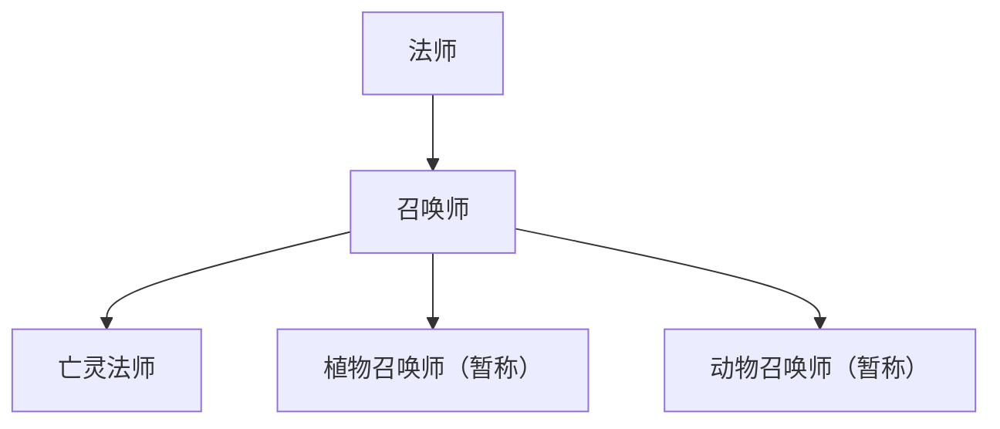

# 职业与派生成长

状态：策划初稿，待实现。剑士、法师、弓箭手、盗贼、条件派生与多层派生为已确定方向；召唤师的亡灵、植物和动物召唤分支为已确认的方向示例，具体名称、能力和解锁条件待细化；其余新增职业与派生候选为建议。

## 职业结构

玩家选择基础职业，获得明确的战斗起点。在游玩过程中，通过等级、讨伐、事件、持有道具等条件解锁派生方向。

职业与技能是角色长期培养的一部分，随 [角色存档](../角色系统/角色存档与长期成长.md)延续，并用于单人和联机探索。玩家通过装备提升、转职和技能获得增强实力，逐步挑战更深层。正式获得的技能与临时试用能力分别记录；技能来源、学习条件、升级和装备槽位待细化。

派生职业可以继续产生后续派生，形成多层成长路线。每条派生关系都需要描述自身前置与解锁条件，后续设计应保留继续扩展层级和分支的空间。具体层数与终点职业待确认。

本文暂将用户所称“副职业”记录为“派生职业”，用于描述剑士向狂战士等方向发展。派生是否替换基础职业、并行装备、自由切换或允许多条路线共存，均待确认。生活职业另行讨论。

## 参考研究

[D&D 2024 官方职业规则](https://www.dndbeyond.com/sources/dnd/br-2024/character-classes)列出战士、野蛮人、游侠、游荡者、法师、术士、契术师、牧师、圣武士、德鲁伊、吟游诗人和武僧十二种职业原型，并设有子职业。其狂战士属于野蛮人的子职业。

本项目按卡牌战斗与地下城冒险需求重新组织职业。职业为角色提供技能卡与战斗定位，卡牌规则见 [卡牌战斗](../战斗系统/卡牌战斗.md)。弓箭手独立作为基础选择，剑士可派生狂战士。下表属于项目方案，基础职业数量尚未锁定。

## 基础职业与派生候选

| 基础职业 | 状态 | 战斗定位建议 | 派生候选 |
| --- | --- | --- | --- |
| 剑士 | 已确定方向 | 近战攻防、节奏与武器技巧 | 狂战士、守护骑士、魔剑士 |
| 法师 | 已确定方向 | 远程施法、范围控制和元素组合 | 元素使、战斗法师、召唤师 |
| 弓箭手 | 已确定方向 | 远程精准、走位和目标选择 | 神射手、游侠、魔弓手 |
| 盗贼 | 已确定方向 | 机动、弱点攻击和探索技巧 | 刺客、影行者、寻宝者 |
| 祭司 | 新增候选 | 治疗、防护与净化，兼顾独立战斗 | 神官、战斗祭司、圣骑士 |
| 格斗家 | 新增候选 | 近身连击、位移和控制 | 武僧、斗士 |
| 吟游诗人 | 扩展候选 | 队伍辅助、干扰和节奏控制 | 战歌使、幻音师 |
| 德鲁伊 | 扩展候选 | 自然法术、变形与生存 | 兽形使、自然贤者 |

术士、契术师等魔法来源差异可作为法师派生或后续独立职业的研究方向。首个可玩版本的职业数量需要结合动画、武器和技能制作规模确定。

## 多层派生示例

已确认的方向示例：法师派生为召唤师，召唤师继续向亡灵法师、植物召唤和动物召唤方向发展。下图中植物召唤师与动物召唤师为暂定称呼。

三个分支以召唤对象区分发展主题，具体召唤方式、控制手段、资源消耗和战斗定位待后续设计。亡灵法师是否具备额外的非召唤能力也需要单独确定。

每一层的能力继承、替换与组合方式均待确认。多层路线允许继续扩展，当前示例不限定所有职业都采用相同层数或分支数量。

## 条件派生

每条派生需要描述前置职业、条件组合、进度、触发地点、确认方式和结果。条件可以同时满足，也可以提供多种替代路径。持有、交付、消耗道具应分别表述。

前置职业可以是基础职业，也可以是已获得的派生职业。各阶段分别核对条件并记录进度，职业获得后的后续分支按自身条件开放。

以下为待确认示例：

| 派生 | 条件示例 | 完成结果示例 |
| --- | --- | --- |
| 剑士 → 狂战士 | 达到要求等级，完成指定强敌讨伐，并通过试炼事件 | 获得该派生的选择资格 |
| 法师 → 元素使 | 持有元素核心，并在肉鸽事件中完成元素共鸣 | 记录共鸣进度，开放后续转职任务 |
| 弓箭手 → 魔弓手 | 获得特殊素材，打造指定武器，再完成试射挑战 | 解锁魔弓手路线 |
| 盗贼 → 寻宝者 | 完成探索委托并发现特殊宝箱事件 | 解锁探索相关的职业能力 |
| 召唤师 → 亡灵法师 | 获得召唤师职业，完成亡灵相关试炼 | 获得亡灵法师分支的选择资格 |
| 召唤师 → 植物召唤师（暂称） | 获得召唤师职业，在特定事件中完成植物契约 | 获得植物召唤分支的选择资格 |
| 召唤师 → 动物召唤师（暂称） | 获得召唤师职业，与指定动物或魔兽建立契约 | 获得动物召唤分支的选择资格 |

肉鸽系统可提供条件机会、临时试用能力或试炼入口；最终资格与职业进度由职业规则判断。临时能力、解锁资格、正式职业获得需要分别呈现。

神明试炼与眷族委托可承载派生条件，使职业成长具备世界内的来源。职业与眷族分别描述能力发展和组织关系，两者的绑定程度待确认。

## 玩家反馈与模块关系

升级或转职可触发角色插画解锁，例如转职狂战士后解锁对应成长形象。具体条件和资源覆盖见 [角色插画与成长解锁](../角色系统/角色插画与成长解锁.md)，职业系统提供正式成长结果供条件判断。

职业界面展示当前职业、已获得的前置职业、已知后续分支及各阶段条件和完成进度。隐藏派生的线索揭示程度待确认。角色外形、武器动作与特效共同表达职业差异。

关联：[全局肉鸽机制](../肉鸽系统/全局肉鸽机制.md)、[武器掉落与打造](../装备与物品/武器掉落与打造.md)、[任务交接与补给交易](../任务与交易/任务交接与补给交易.md)。

## 待确认

- 等级、经验、属性和职业专精的关系。
- 派生后保留哪些能力、能否重置及切换成本。
- 各路线的派生层数、分支数量、跨分支发展与能力继承规则。
- 职业与武器的可用范围，以及跨职业配装空间。
- 联机讨伐的参与判定与队伍成员条件共享规则。
- 随机派生机会是否提供保底或替代途径。
